# 1. 研究背景
人类在自然场景中可以快速定位并识别看到的文字信息，但是想要计算机做到和人类一样是比较困难的。开发人员一直想要让机器也能识别图像中的文字信息。当然,对于自然场景来说,图像中的信息复杂甚至是低效的,文字旁的物体﹑光影,以及字体颜色、大小、书写风格,都会给机器识别带来不同程度的影响。图像文本识别通常被划分为两个部分:文本检测与文本识别。
文本检测是文本识别首先要做的一步,是必不可缺的一步。要让机器识别自然场景中获取的文本信息,要先让机器知道文本信息的位置。现在也有很多文本检测的解决方案,但是在面对复杂的图像时,往往抗干扰能力不尽如人意。而且这些图像通常会有不同字体(例如艺术文字),不同形状,严重影响了文本的检测与识别。

# 2.多语言选择模块
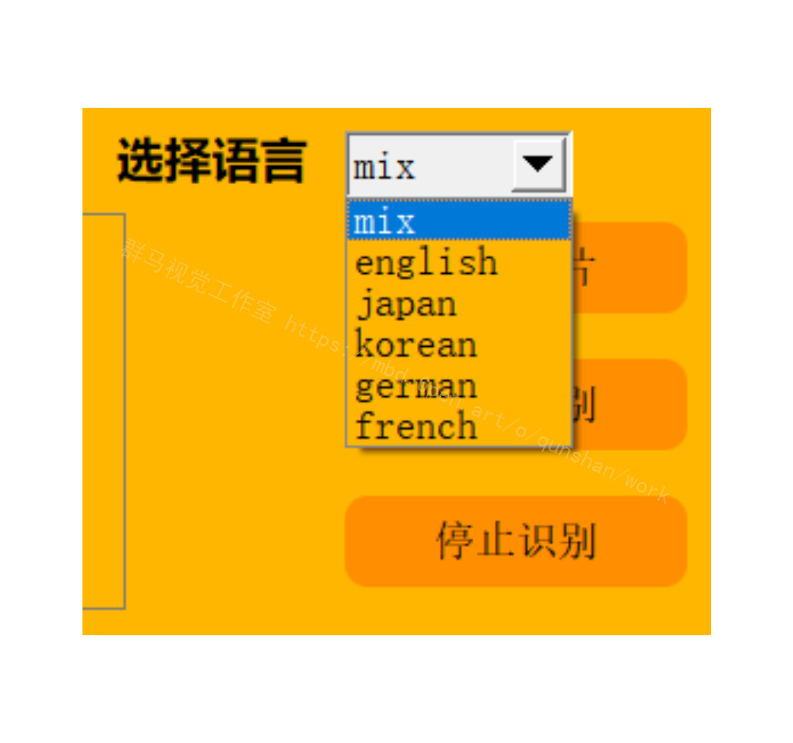

# 3.识别效果展示
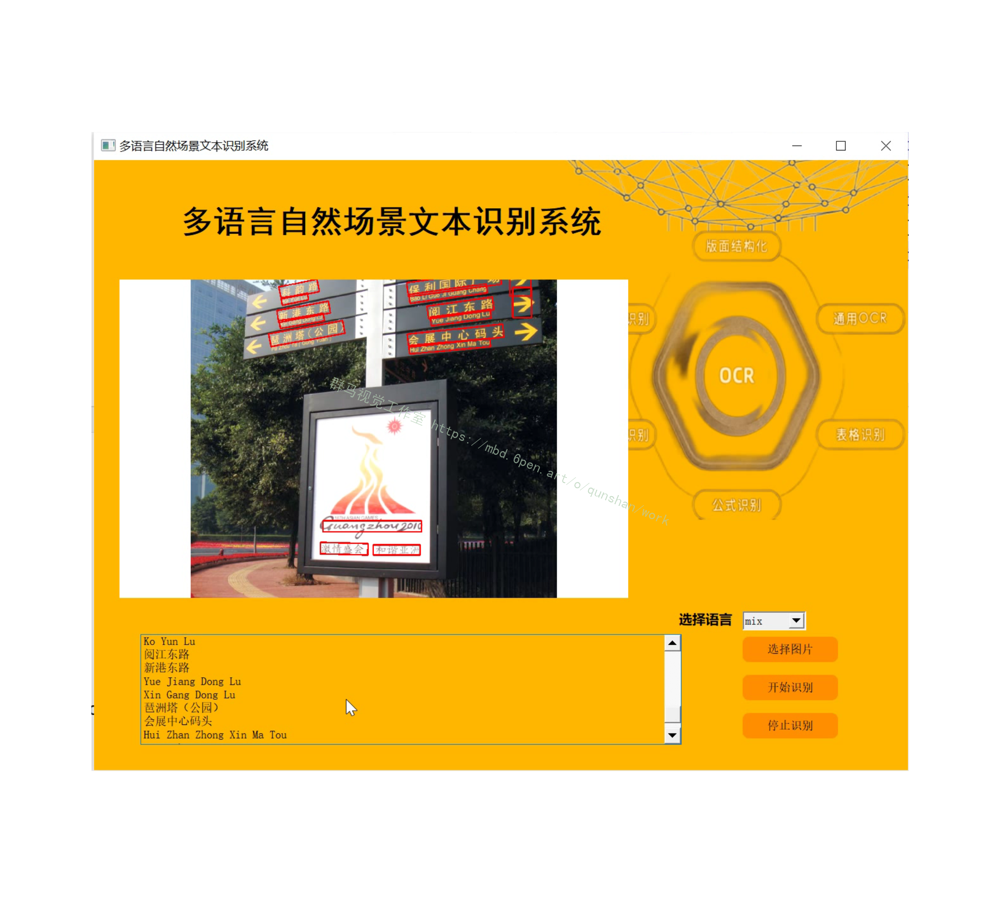

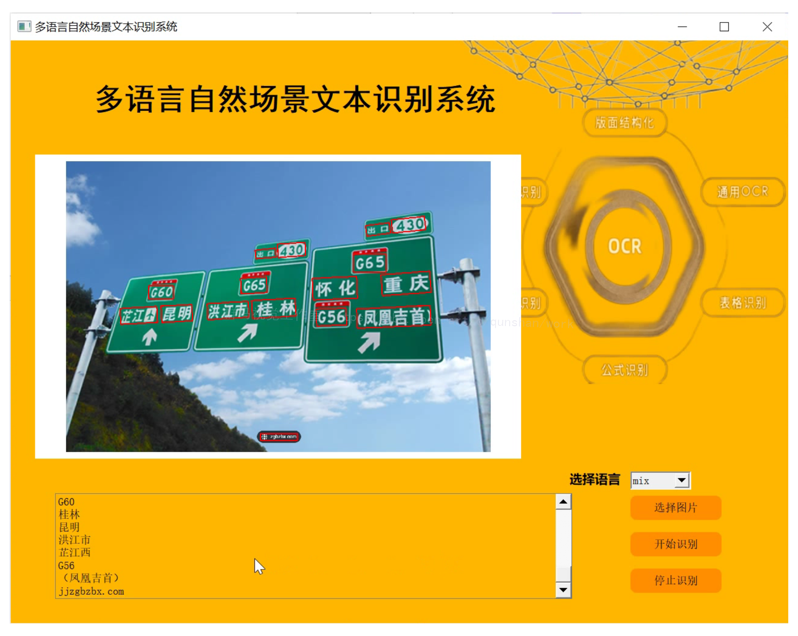
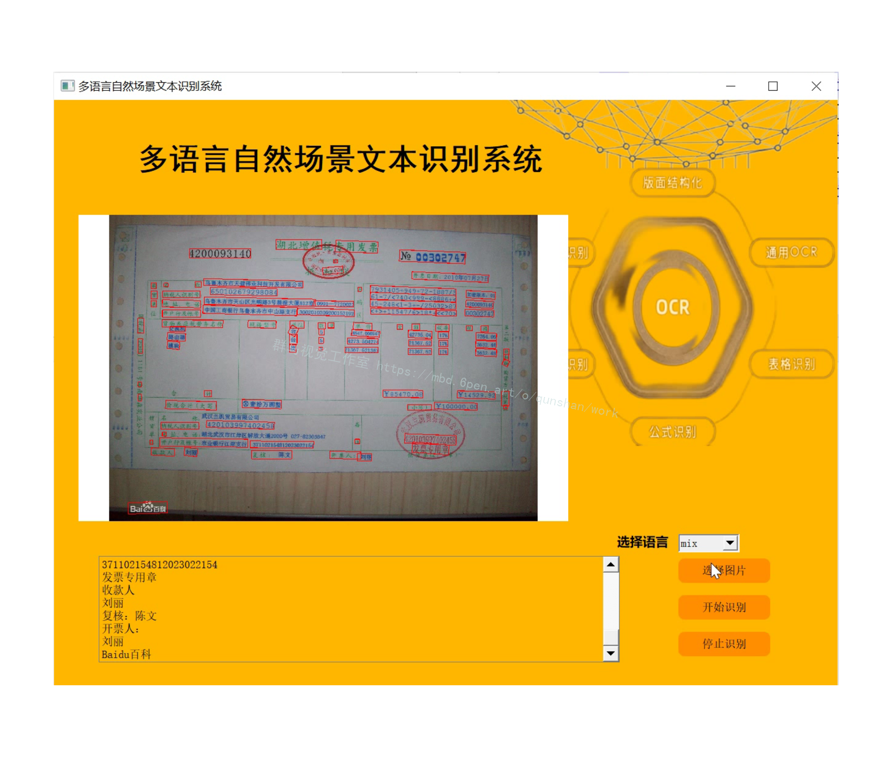

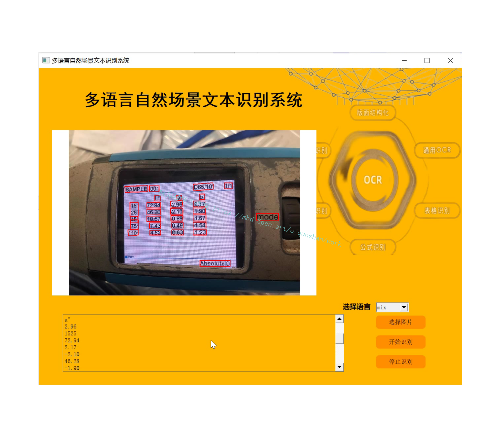

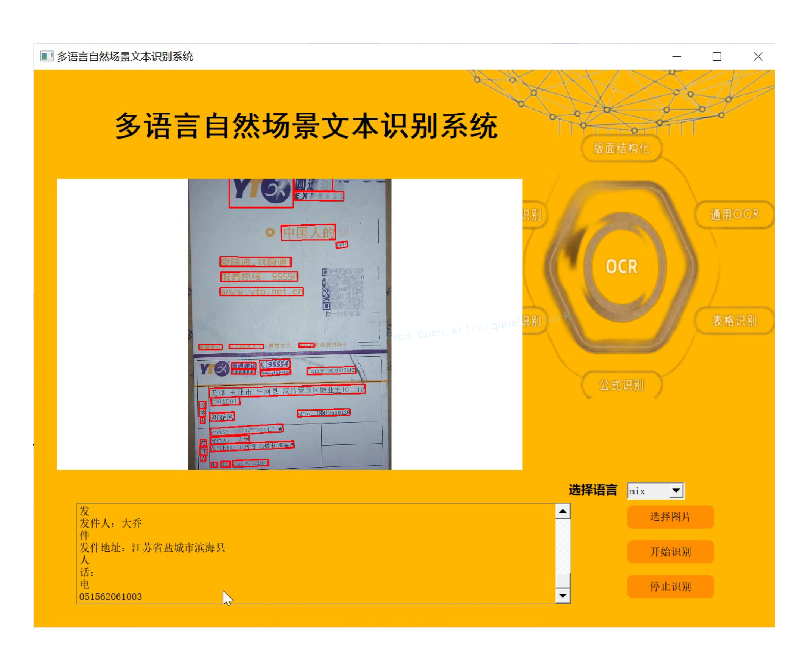

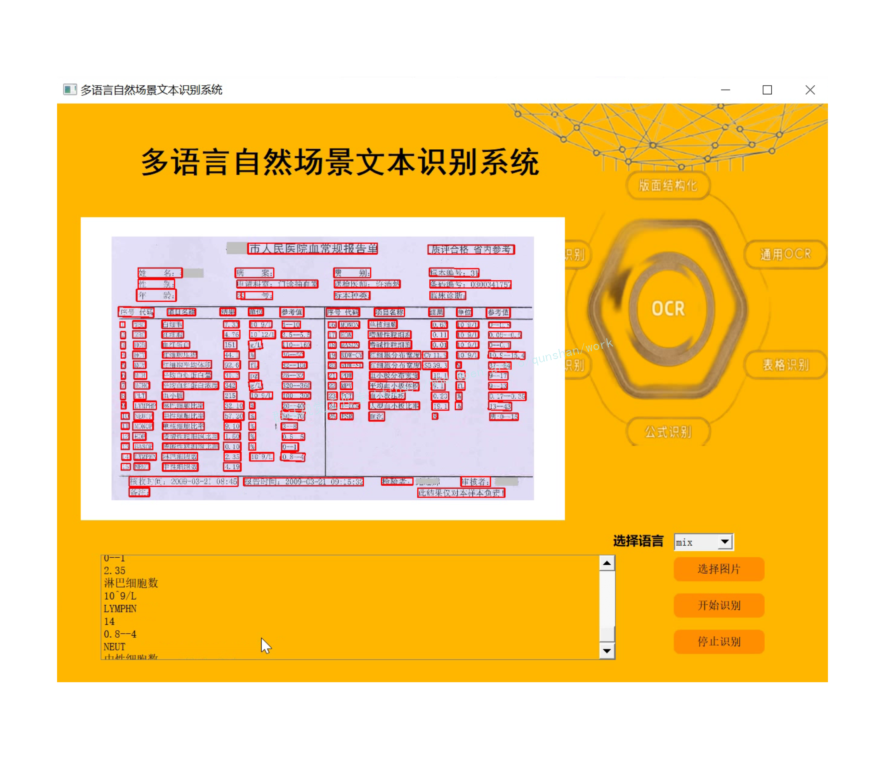

# 4.效果视频演示
[Opencv多语言自然场景文本识别系统（源码＆教程）_哔哩哔哩_bilibili](https://www.bilibili.com/video/BV1UP411J7pr/?vd_source=bc9aec86d164b67a7004b996143742dc)


# 5.文本识别算法CRNN
文本识别是把文字图片转换成计算机可读文本的过程，输入是从原图中裁剪出来的候选区域的图片，输出是图片中包含的文字序列。目前的文本识别方法把识别任务看作一种序列识别任务，可以省略字符的分割。和一般图像分类任务不一样，文本识别输出的是文字序列，长度不固定。如图所示，根据序列建模方式的不同 将 目 前 文 本 识 别 方 法 分 为 两 大 类 ： 
1.基 于 CTC(Connectionist Temporal Classification)的文本识别算法
2.[基于注意力机制的文本识别算法](https://mbd.pub/o/bread/Y5iTmZdp)
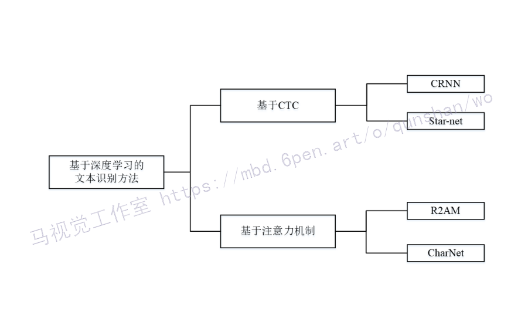

文本识别的目的是将候选区域中的文本图案识别为标准的文字，由于文本识别算法并不是论文的研究重点,所以本节只介绍文中使用到的CRNN文本识别算法。
CRNN的主要思想就是将文本识别看作是对序列的预测，而不是将文本看作独立的目标，所以采用了RNN网络来预测序列，算法的主要流程可以分为三个部分:通过CNN网络提取图像特征，然后采用BiSTLM(双向长短时记忆)网络来对序列进行预测，最后通过CTC转录层来得到最终的结果。
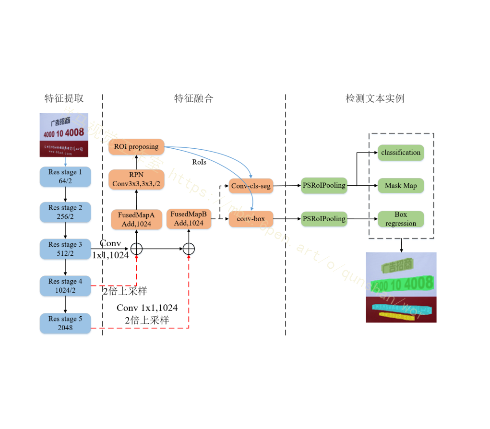

#### 代码实现
```
class CRNN(nn.Module):
    def __init__(self, characters_classes, hidden=256, pretrain=True):
        super(CRNN, self).__init__()
        self.characters_class = characters_classes
        self.body = VGG()
        self.stage5 = nn.Conv2d(512, 512, kernel_size=(3, 2), padding=(1, 0))
        self.hidden = hidden
        self.rnn = nn.Sequential(BidirectionalLSTM(512, self.hidden, self.hidden),
                                 BidirectionalLSTM(self.hidden, self.hidden, self.characters_class))

        self.pretrain = pretrain
        if self.pretrain:
            import torchvision.models.vgg as vgg
            pre_net = vgg.vgg16(pretrained=True)
            pretrained_dict = pre_net.state_dict()
            model_dict = self.body.state_dict()
            pretrained_dict = {k: v for k, v in pretrained_dict.items() if k in model_dict}
            model_dict.update(pretrained_dict)
            self.body.load_state_dict(model_dict)

            for param in self.body.parameters():
                param.requires_grad = False

    def forward(self, x):
        x = self.body(x)
        x = self.stage5(x)
        x = x.squeeze(3)
        x = x.permute(2, 0, 1).contiguous()
        x = self.rnn(x)
        x = F.log_softmax(x, dim=2)
        return x
```


# 6.基于改进CTC的方法
[参考该博客直接将字符特征序列转化为字符概率](https://afdian.net/item?plan_id=a58256d25cae11edb38352540025c377)，通过CTC损失来得到识别Loss。受到语音识别的启发，CRNN将CTC引入到基于图像的序列识别中，CRNN是一种端到端的文本序列识别系统，包括卷积模块、递归模块和转录模块。为了提取来自相关上下文的信息，用到了一种循环卷积神经网络——LSTM，在LSTM中通过“门”来控制历史信息的遗忘和当先状态的更新。Star-net将空间变换和CRNN相结合，引入空间注意力机制对具有几何畸变的文本图像进行校正，从而实现对具有几何畸变的场景文本的识别。为了避免RNN训练过程中的梯度退化和梯度爆炸。
Gao提出了一种端到端的全卷积文本识别网络，该网络采用CNN捕捉长期依赖关系，并代替RNN生成序列特征，该模型大大提高了识别器的识别速度。文献[1]-[2]同样运用神经网络结合CTC实现了准确鲁棒的识别自然场景中倾斜的文本，如下图所示。

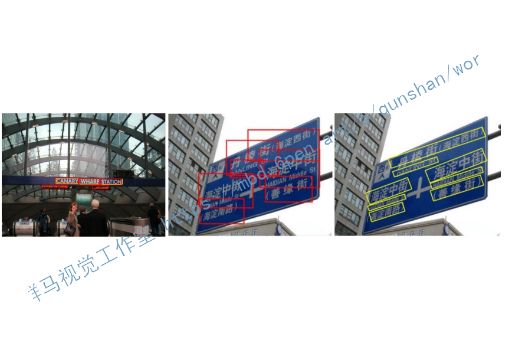

#### 代码实现
```
def ctc(img, text_recs, adjust=False):
    """
    加载CTC模型，进行字符识别
    """
    results = {}
    xDim, yDim = img.shape[1], img.shape[0]

    for index, rec in enumerate(text_recs):
        xlength = int((rec[6] - rec[0]) * 0.1)
        ylength = int((rec[7] - rec[1]) * 0.2)
        if adjust:
            pt1 = (max(1, rec[0] - xlength), max(1, rec[1] - ylength))
            pt2 = (rec[2], rec[3])
            pt3 = (min(rec[6] + xlength, xDim - 2), min(yDim - 2, rec[7] + ylength))
            pt4 = (rec[4], rec[5])
        else:
            pt1 = (max(1, rec[0]), max(1, rec[1]))
            pt2 = (rec[2], rec[3])
            pt3 = (min(rec[6], xDim - 2), min(yDim - 2, rec[7]))
            pt4 = (rec[4], rec[5])

        degree = degrees(atan2(pt2[1] - pt1[1], pt2[0] - pt1[0]))  # 图像倾斜角度

        partImg = dumpRotateImage(img, degree, pt1, pt2, pt3, pt4)
        # dis(partImg)
        if partImg.shape[0] < 1 or partImg.shape[1] < 1 or partImg.shape[0] > partImg.shape[1]:  # 过滤异常图片
            continue
        text = recognizer.recognize(partImg)
        if len(text) > 0:
            results[index] = [rec]
            results[index].append(text)  # 识别文字

    return results
```

# 7.系统整合
下图[源码＆环境部署视频教程＆自定义UI界面](https://s.xiaocichang.com/s/b8f95e)
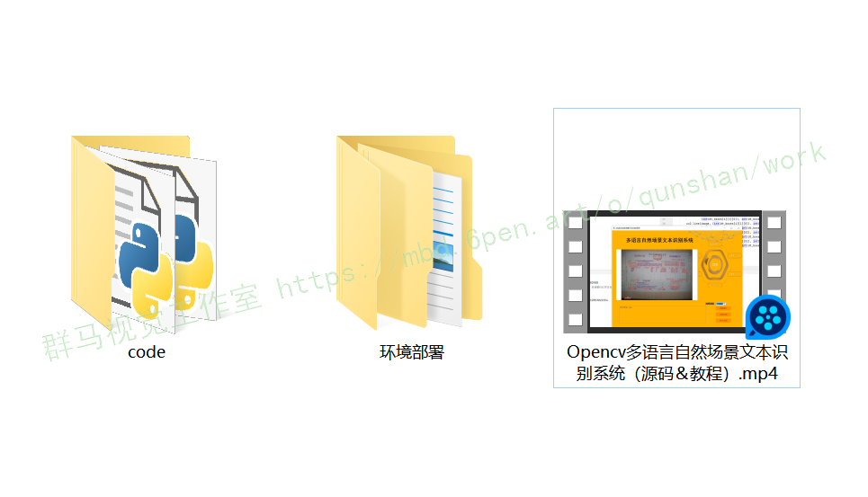

参考文献[《Opencv多语言自然场景文本识别系统（源码＆教程）》](https://mbd.pub/o/qunma/work)


# 8.参考文献
[1]韩宇.基于CNN及RPN技术的文字识别应用[J].机电信息.2019,(21).90-91,93.DOI:10.3969/j.issn.1671-0797.2019.21.046.
[2]李颖,刘菊华,易尧华.自然场景图像的字符识别方法[J].包装工程.2018,(5).168-172.
[3]李文轩,孙季丰.基于复合优化的深度玻尔兹曼机的路牌文字图像识别算法[J].计算机工程与科学.2018,(1).79-85.DOI:10.3969/j.issn.1007-130X.2018.01.012.
[4]万萌.基于深度学习的自然场景文字检测与识别方法研究[D].2019
[5]陈桂安.端到端的自然场景文字检测与识别神经网络的研究与实现[D].2019
[6]Baoguang Shi,Xiang Bai,Cong Yao.An End-to-End Trainable Neural Network for Image-Based Sequence Recognition and Its Application to Scene Text Recognition[J].IEEE Transactions on Pattern Analysis & Machine Intelligence.2017,39(11).2298-2304.

---
#### 如果您需要更详细的【源码和环境部署教程】，除了通过【系统整合】小节的链接获取之外，还可以通过邮箱以下途径获取:
#### 1.请先在GitHub上为该项目点赞（Star），编辑一封邮件，附上点赞的截图、项目的中文描述概述（About）以及您的用途需求，发送到我们的邮箱
#### sharecode@yeah.net
#### 2.我们收到邮件后会定期根据邮件的接收顺序将【完整源码和环境部署教程】发送到您的邮箱。
#### 【免责声明】本文来源于用户投稿，如果侵犯任何第三方的合法权益，可通过邮箱联系删除。